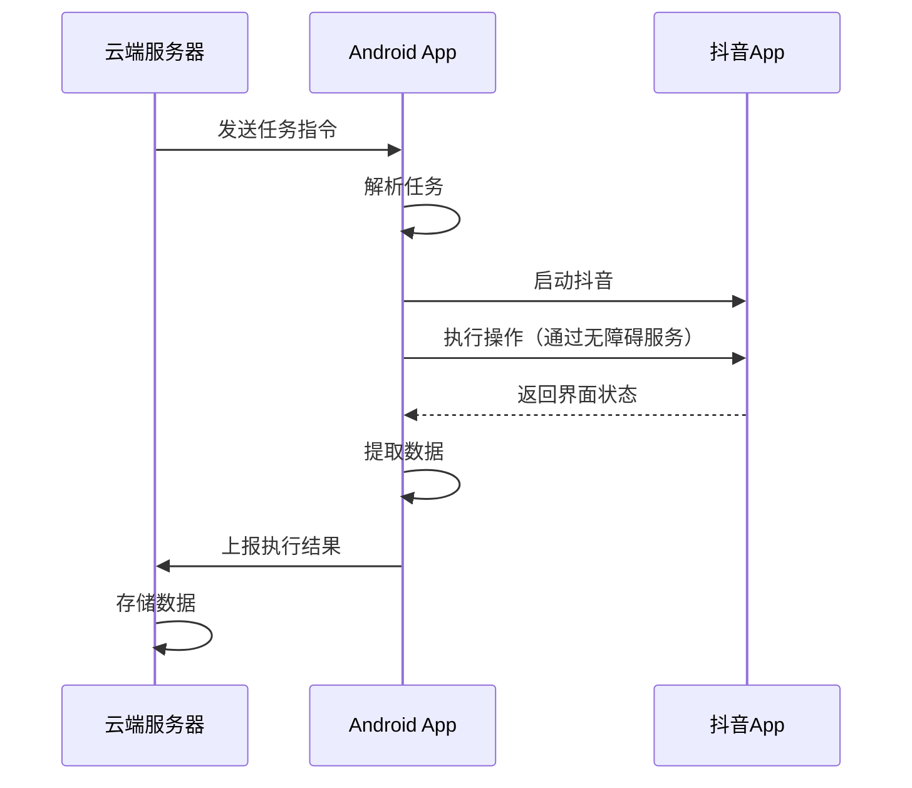

# 云端控制 + Android App 架构方案

## 📋 方案概述

**核心思路：**
开发一个Android App安装在手机上，云端服务器通过网络连接控制App执行自动化任务。

**架构模式：**
```
云端控制中心 ←→ 网络通信 ←→ Android App（手机端）
```

**相比传统ADB方案的优势：**
- ✅ 无需USB连接，真正的远程控制
- ✅ 更稳定的连接（不依赖ADB）
- ✅ 更好的权限控制（App内部操作）
- ✅ 可以利用Android原生API
- ✅ 更容易规模化部署（云控多台设备）

---

## 🏗️ 整体架构设计

### 系统架构图

```
┌─────────────────────────────────────────────────────────────┐
│                      云端控制中心                              │
│  ┌──────────────┐  ┌──────────────┐  ┌──────────────┐      │
│  │  任务调度器   │  │  设备管理器   │  │  数据分析     │      │
│  └──────────────┘  └──────────────┘  └──────────────┘      │
│  ┌──────────────┐  ┌──────────────┐  ┌──────────────┐      │
│  │  Web控制台   │  │  API服务     │  │  数据库       │      │
│  └──────────────┘  └──────────────┘  └──────────────┘      │
└─────────────────────────┬───────────────────────────────────┘
                          │ WebSocket / MQTT / HTTP
                          │
        ┌─────────────────┼─────────────────┐
        │                 │                 │
┌───────▼──────┐  ┌───────▼──────┐  ┌───────▼──────┐
│  手机1 + App  │  │  手机2 + App  │  │  手机N + App  │
│              │  │              │  │              │
│ ┌──────────┐ │  │ ┌──────────┐ │  │ ┌──────────┐ │
│ │抖音自动化 │ │  │ │抖音自动化 │ │  │ │抖音自动化 │ │
│ │  模块    │ │  │ │  模块    │ │  │ │  模块    │ │
│ └──────────┘ │  │ └──────────┘ │  │ └──────────┘ │
│ ┌──────────┐ │  │ ┌──────────┐ │  │ ┌──────────┐ │
│ │无障碍服务 │ │  │ │无障碍服务 │ │  │ │无障碍服务 │ │
│ └──────────┘ │  │ └──────────┘ │  │ └──────────┘ │
└──────────────┘  └──────────────┘  └──────────────┘
```

### 通信流程



---

## 📱 Android App 设计

### 核心功能模块

#### 1. 通信模块
```kotlin
/**
 * 与云端服务器通信
 * - WebSocket长连接
 * - 心跳保活
 * - 断线重连
 * - 消息队列
 */
class CloudCommunicator {
    fun connect(serverUrl: String)
    fun sendMessage(message: Message)
    fun receiveTask(): Task
    fun reportStatus(status: Status)
}
```

#### 2. 无障碍服务模块
```kotlin
/**
 * Android无障碍服务
 * - 监听界面变化
 * - 模拟点击、滑动
 * - 提取界面文本
 * - 截图功能
 */
class AutomationAccessibilityService : AccessibilityService() {
    fun clickElement(text: String)
    fun scrollDown()
    fun extractText(): List<String>
    fun takeScreenshot(): Bitmap
}
```

#### 3. 抖音操作模块
```kotlin
/**
 * 抖音专用操作封装
 * - 搜索博主
 * - 浏览作品
 * - 查看评论
 * - 发送私信
 */
class DouyinAutomation {
    fun searchBlogger(name: String)
    fun getVideoList(): List<Video>
    fun collectComments(videoId: String): List<Comment>
    fun sendMessage(userId: String, content: String)
}
```

#### 4. 数据存储模块
```kotlin
/**
 * 本地数据缓存
 * - SQLite数据库
 * - SharedPreferences配置
 * - 文件缓存
 */
class LocalStorage {
    fun saveComment(comment: Comment)
    fun getUnsentMessages(): List<Message>
    fun cacheScreenshot(bitmap: Bitmap)
}
```

#### 5. 任务执行模块
```kotlin
/**
 * 任务调度和执行
 * - 任务队列管理
 * - 并发控制
 * - 错误重试
 * - 状态上报
 */
class TaskExecutor {
    fun executeTask(task: Task): Result
    fun pauseTask()
    fun resumeTask()
    fun cancelTask()
}
```

### Android App 技术栈

```kotlin
// 开发语言
Kotlin + Java

// UI框架
Jetpack Compose / XML

// 网络通信
- OkHttp (HTTP)
- Scarlet (WebSocket)
- Paho (MQTT)

// 数据库
Room (SQLite封装)

// 依赖注入
Hilt / Koin

// 异步处理
Coroutines + Flow

// 图像处理
OpenCV Android
ML Kit (Google)

// 日志
Timber

// 权限管理
PermissionsDispatcher
```

---

## ☁️ 云端服务器设计

### 核心功能模块

#### 1. 设备管理
```python
class DeviceManager:
    """设备管理器"""
    
    def register_device(self, device_id: str, info: dict):
        """注册新设备"""
        pass
    
    def get_online_devices(self) -> List[Device]:
        """获取在线设备列表"""
        pass
    
    def assign_task(self, device_id: str, task: Task):
        """分配任务给设备"""
        pass
    
    def monitor_device_status(self, device_id: str):
        """监控设备状态"""
        pass
```

#### 2. 任务调度
```python
class TaskScheduler:
    """任务调度器"""
    
    def create_task(self, task_config: dict) -> Task:
        """创建任务"""
        pass
    
    def distribute_tasks(self, tasks: List[Task]):
        """分发任务到设备"""
        pass
    
    def balance_load(self):
        """负载均衡"""
        pass
    
    def retry_failed_tasks(self):
        """重试失败任务"""
        pass
```

#### 3. 数据收集
```python
class DataCollector:
    """数据收集器"""
    
    def receive_comment_data(self, data: dict):
        """接收评论数据"""
        pass
    
    def receive_message_result(self, result: dict):
        """接收私信发送结果"""
        pass
    
    def aggregate_data(self) -> dict:
        """聚合数据"""
        pass
```

#### 4. Web控制台
```python
# FastAPI + Vue.js
class WebConsole:
    """Web控制台"""
    
    @app.get("/devices")
    def list_devices():
        """设备列表"""
        pass
    
    @app.post("/tasks")
    def create_task(task: TaskCreate):
        """创建任务"""
        pass
    
    @app.get("/reports")
    def get_reports():
        """查看报告"""
        pass
```

### 云端技术栈

```python
# 后端框架
FastAPI + Python 3.9+

# 实时通信
WebSocket / Socket.IO
MQTT (Mosquitto)

# 数据库
PostgreSQL (主数据库)
Redis (缓存 + 消息队列)
MongoDB (日志存储)

# 任务队列
Celery + RabbitMQ

# 监控
Prometheus + Grafana

# 容器化
Docker + Kubernetes

# 前端
Vue.js 3 + Element Plus
```

---

## 🔐 Android无障碍服务实现

### 核心代码示例

#### 1. 无障碍服务配置

```xml
<!-- res/xml/accessibility_service_config.xml -->
<accessibility-service
    xmlns:android="http://schemas.android.com/apk/res/android"
    android:accessibilityEventTypes="typeAllMask"
    android:accessibilityFeedbackType="feedbackGeneric"
    android:accessibilityFlags="flagDefault|flagReportViewIds|flagRetrieveInteractiveWindows"
    android:canRetrieveWindowContent="true"
    android:description="@string/accessibility_service_description"
    android:notificationTimeout="100"
    android:packageNames="com.ss.android.ugc.aweme" />
```

#### 2. 无障碍服务实现

```kotlin
class DouyinAccessibilityService : AccessibilityService() {
    
    override fun onAccessibilityEvent(event: AccessibilityEvent?) {
        event?.let {
            when (it.eventType) {
                AccessibilityEvent.TYPE_WINDOW_STATE_CHANGED -> {
                    handleWindowChange(it)
                }
                AccessibilityEvent.TYPE_VIEW_CLICKED -> {
                    handleViewClick(it)
                }
            }
        }
    }
    
    /**
     * 点击包含指定文本的元素
     */
    fun clickByText(text: String): Boolean {
        val nodeInfo = rootInActiveWindow ?: return false
        val targetNode = findNodeByText(nodeInfo, text)
        return targetNode?.performAction(AccessibilityNodeInfo.ACTION_CLICK) ?: false
    }
    
    /**
     * 向下滚动
     */
    fun scrollDown(): Boolean {
        val nodeInfo = rootInActiveWindow ?: return false
        return nodeInfo.performAction(AccessibilityNodeInfo.ACTION_SCROLL_FORWARD)
    }
    
    /**
     * 提取屏幕上的所有文本
     */
    fun extractAllText(): List<String> {
        val texts = mutableListOf<String>()
        val nodeInfo = rootInActiveWindow ?: return texts
        extractTextRecursive(nodeInfo, texts)
        return texts
    }
    
    /**
     * 输入文本
     */
    fun inputText(text: String): Boolean {
        val nodeInfo = rootInActiveWindow ?: return false
        val editText = findEditText(nodeInfo)
        editText?.let {
            val arguments = Bundle()
            arguments.putCharSequence(
                AccessibilityNodeInfo.ACTION_ARGUMENT_SET_TEXT_CHARSEQUENCE,
                text
            )
            return it.performAction(AccessibilityNodeInfo.ACTION_SET_TEXT, arguments)
        }
        return false
    }
    
    private fun findNodeByText(
        node: AccessibilityNodeInfo,
        text: String
    ): AccessibilityNodeInfo? {
        if (node.text?.contains(text) == true) {
            return node
        }
        for (i in 0 until node.childCount) {
            val child = node.getChild(i) ?: continue
            val result = findNodeByText(child, text)
            if (result != null) return result
        }
        return null
    }
    
    override fun onInterrupt() {
        // 服务中断处理
    }
}
```

#### 3. 抖音操作封装

```kotlin
class DouyinAutomation(
    private val accessibilityService: DouyinAccessibilityService,
    private val cloudCommunicator: CloudCommunicator
) {
    
    /**
     * 搜索博主
     */
    suspend fun searchBlogger(bloggerName: String): Boolean {
        return withContext(Dispatchers.IO) {
            try {
                // 1. 点击搜索按钮
                accessibilityService.clickByText("搜索")
                delay(1000)
                
                // 2. 输入博主名称
                accessibilityService.inputText(bloggerName)
                delay(500)
                
                // 3. 点击搜索结果
                accessibilityService.clickByText(bloggerName)
                delay(2000)
                
                true
            } catch (e: Exception) {
                Log.e(TAG, "搜索博主失败", e)
                false
            }
        }
    }
    
    /**
     * 采集视频评论
     */
    suspend fun collectVideoComments(videoUrl: String): List<Comment> {
        val comments = mutableListOf<Comment>()
        
        return withContext(Dispatchers.IO) {
            try {
                // 1. 打开视频
                openVideo(videoUrl)
                delay(2000)
                
                // 2. 点击评论区
                accessibilityService.clickByText("评论")
                delay(1000)
                
                // 3. 滚动加载评论
                repeat(10) {
                    val screenComments = extractCommentsFromScreen()
                    comments.addAll(screenComments)
                    
                    accessibilityService.scrollDown()
                    delay(1000)
                }
                
                // 4. 上报到云端
                cloudCommunicator.sendMessage(
                    Message(
                        type = "COMMENTS_COLLECTED",
                        data = comments
                    )
                )
                
                comments
            } catch (e: Exception) {
                Log.e(TAG, "采集评论失败", e)
                emptyList()
            }
        }
    }
    
    /**
     * 发送私信
     */
    suspend fun sendPrivateMessage(
        userId: String,
        content: String
    ): Boolean {
        return withContext(Dispatchers.IO) {
            try {
                // 1. 进入用户主页
                openUserProfile(userId)
                delay(1000)
                
                // 2. 点击私信按钮
                accessibilityService.clickByText("私信")
                delay(1000)
                
                // 3. 输入消息
                accessibilityService.inputText(content)
                delay(500)
                
                // 4. 点击发送
                accessibilityService.clickByText("发送")
                delay(1000)
                
                // 5. 上报结果
                cloudCommunicator.sendMessage(
                    Message(
                        type = "MESSAGE_SENT",
                        data = mapOf(
                            "userId" to userId,
                            "status" to "success"
                        )
                    )
                )
                
                true
            } catch (e: Exception) {
                Log.e(TAG, "发送私信失败", e)
                cloudCommunicator.sendMessage(
                    Message(
                        type = "MESSAGE_SENT",
                        data = mapOf(
                            "userId" to userId,
                            "status" to "failed",
                            "error" to e.message
                        )
                    )
                )
                false
            }
        }
    }
    
    private fun extractCommentsFromScreen(): List<Comment> {
        val texts = accessibilityService.extractAllText()
        // 解析文本，提取评论信息
        return parseComments(texts)
    }
}
```

---

## 🌐 通信协议设计

### WebSocket消息格式

```json
// 云端 → App：任务指令
{
  "type": "TASK",
  "taskId": "task_123456",
  "action": "COLLECT_COMMENTS",
  "params": {
    "blogger": "美食博主A",
    "maxVideos": 10
  },
  "timestamp": 1234567890
}

// App → 云端：执行结果
{
  "type": "RESULT",
  "taskId": "task_123456",
  "status": "success",
  "data": {
    "commentsCount": 150,
    "users": [...]
  },
  "timestamp": 1234567890
}

// App → 云端：心跳
{
  "type": "HEARTBEAT",
  "deviceId": "device_001",
  "status": "online",
  "battery": 85,
  "timestamp": 1234567890
}
```

### MQTT主题设计

```
# 设备注册
devices/register

# 任务分发
tasks/{device_id}/assign

# 任务结果
tasks/{device_id}/result

# 设备状态
devices/{device_id}/status

# 日志上报
logs/{device_id}
```

---

## 📊 方案对比分析

### 三种方案对比

| 维度 | ADB方案 | 云端+App方案 | Appium方案 |
|------|---------|-------------|-----------|
| **连接方式** | USB/WiFi ADB | 网络（WebSocket/MQTT） | USB/网络 |
| **稳定性** | ⭐⭐⭐ | ⭐⭐⭐⭐⭐ | ⭐⭐⭐ |
| **远程控制** | ❌ 需要同网络 | ✅ 真正远程 | ❌ 需要同网络 |
| **权限要求** | 需要USB调试 | 需要无障碍权限 | 需要USB调试 |
| **开发难度** | ⭐⭐⭐ | ⭐⭐⭐⭐ | ⭐⭐ |
| **扩展性** | ⭐⭐ | ⭐⭐⭐⭐⭐ | ⭐⭐⭐ |
| **成本** | 低 | 中（需要服务器） | 低 |
| **维护性** | ⭐⭐⭐ | ⭐⭐⭐⭐ | ⭐⭐ |
| **规模化** | ❌ 难 | ✅ 易（云控） | ⭐⭐ |
| **反检测** | ⭐⭐⭐ | ⭐⭐⭐⭐ | ⭐⭐⭐ |

### 云端+App方案的优势

✅ **真正的远程控制**
- 不需要USB连接
- 不需要在同一网络
- 手机可以在任何地方

✅ **更好的稳定性**
- 不依赖ADB连接
- 断线自动重连
- 任务队列保证

✅ **易于规模化**
- 一个云端控制多台设备
- 负载均衡
- 集中管理

✅ **更强的功能**
- 利用Android原生API
- 更精确的控制
- 更丰富的数据采集

✅ **更好的用户体验**
- App可以有UI界面
- 用户可以查看执行状态
- 支持手动干预

### 云端+App方案的挑战

⚠️ **开发复杂度高**
- 需要开发Android App
- 需要开发云端服务
- 需要设计通信协议

⚠️ **需要服务器成本**
- 云服务器费用
- 带宽费用
- 存储费用

⚠️ **需要用户安装App**
- 需要用户授权无障碍权限
- 可能被应用商店拒绝
- 需要持续更新维护

⚠️ **安全性要求高**
- 通信加密
- 身份认证
- 数据安全

---

## 🚀 实施方案

### 阶段1：原型验证（1-2周）

**目标：** 验证技术可行性

**任务：**
1. 开发简单的Android App
   - 实现无障碍服务
   - 实现基本的抖音操作
   - 测试权限和兼容性

2. 搭建简单的云端服务
   - WebSocket服务器
   - 简单的任务分发
   - 数据接收和存储

3. 测试通信
   - 云端下发任务
   - App执行并上报
   - 验证稳定性

### 阶段2：核心功能开发（3-4周）

**Android App开发：**
- [ ] 完善无障碍服务
- [ ] 实现评论采集功能
- [ ] 实现私信发送功能
- [ ] 添加本地数据库
- [ ] 实现任务队列
- [ ] 添加错误处理和重试

**云端服务开发：**
- [ ] 设备管理系统
- [ ] 任务调度系统
- [ ] 数据收集和存储
- [ ] Web控制台
- [ ] 监控和告警

### 阶段3：优化和测试（2-3周）

- [ ] 性能优化
- [ ] 稳定性测试
- [ ] 压力测试
- [ ] 安全加固
- [ ] 文档编写

### 阶段4：部署和运维（1周）

- [ ] 服务器部署
- [ ] App分发
- [ ] 监控配置
- [ ] 运维文档

**总计：7-10周**

---

## 💰 成本估算

### 开发成本

| 项目 | 工作量 | 说明 |
|------|--------|------|
| Android App开发 | 4-5周 | Kotlin开发 |
| 云端服务开发 | 3-4周 | Python + FastAPI |
| 测试和优化 | 2-3周 | 全面测试 |
| **总计** | **9-12周** | 1-2人团队 |

### 运营成本（月）

| 项目 | 费用 | 说明 |
|------|------|------|
| 云服务器 | ¥200-500 | 2核4G |
| 数据库 | ¥100-300 | PostgreSQL |
| 带宽 | ¥100-200 | 按流量计费 |
| 存储 | ¥50-100 | 对象存储 |
| **总计** | **¥450-1100/月** | 小规模运营 |

### 设备成本

| 项目 | 费用 | 说明 |
|------|------|------|
| Android手机 | ¥500-1000/台 | 二手或低端机 |
| 手机卡 | ¥10-30/月/张 | 流量卡 |
| 充电设备 | ¥50-100 | 多口充电器 |

---

## ⚖️ 法律和合规

### 重要提示

⚠️ **App开发需要注意：**

1. **应用商店审核**
   - Google Play / 应用宝可能拒绝自动化App
   - 需要明确说明用途
   - 可能需要企业开发者账号

2. **用户隐私**
   - 无障碍服务权限敏感
   - 需要明确的隐私政策
   - 数据加密传输和存储

3. **平台规则**
   - 可能违反抖音服务条款
   - 账号封禁风险
   - 法律责任风险

4. **建议措施**
   - 仅供内部使用，不公开发布
   - 添加用户协议和免责声明
   - 控制使用频率
   - 定期审查合规性

---

## 🎯 推荐方案

### 最佳实践：混合方案

**方案组合：**
```
云端控制中心
    ↓
┌───────────┬───────────┐
│  开发阶段  │  生产阶段  │
│  ADB方案  │  App方案  │
└───────────┴───────────┘
```

**实施策略：**

1. **第一阶段：快速验证（ADB方案）**
   - 使用ADB快速开发原型
   - 验证业务逻辑
   - 测试反检测策略
   - 评估ROI

2. **第二阶段：规模化部署（App方案）**
   - 开发Android App
   - 搭建云端控制系统
   - 实现真正的远程控制
   - 支持多设备管理

**优势：**
- ✅ 降低初期风险
- ✅ 快速验证可行性
- ✅ 平滑过渡到生产环境
- ✅ 灵活调整策略

---

## 📚 技术参考

### Android无障碍服务
- [官方文档](https://developer.android.com/guide/topics/ui/accessibility/service)
- [最佳实践](https://developer.android.com/guide/topics/ui/accessibility/principles)

### 开源项目参考
- [Auto.js](https://github.com/hyb1996/Auto.js) - Android自动化框架
- [Hamibot](https://github.com/hamibot/hamibot) - 云端控制自动化
- [Tasker](https://tasker.joaoapps.com/) - Android任务自动化

### 云端架构
- [FastAPI](https://fastapi.tiangolo.com/)
- [Socket.IO](https://socket.io/)
- [MQTT](https://mqtt.org/)

---

## ✅ 总结

### 云端+App方案是可行的！

**核心优势：**
1. ✅ 真正的远程控制
2. ✅ 更好的稳定性
3. ✅ 易于规模化
4. ✅ 功能更强大

**主要挑战：**
1. ⚠️ 开发复杂度高
2. ⚠️ 需要服务器成本
3. ⚠️ 需要用户安装App
4. ⚠️ 合规性要求高

**推荐策略：**
- 先用ADB方案快速验证
- 验证成功后开发App方案
- 逐步过渡到云端控制
- 持续优化和迭代

**下一步：**
如果决定采用云端+App方案，建议：
1. 先开发Android App原型
2. 实现基本的无障碍操作
3. 搭建简单的云端服务
4. 测试通信和稳定性
5. 逐步完善功能

需要我详细设计Android App的代码结构吗？或者开始实现原型？
