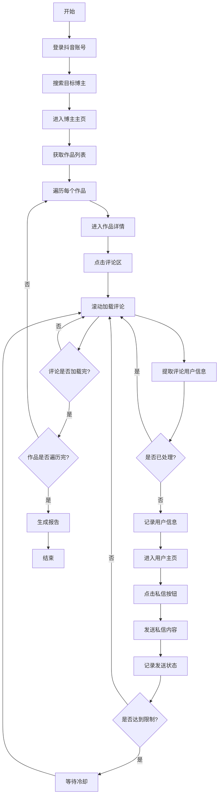

# 抖音评论采集与私信自动化方案

## 📋 项目概述

**核心需求：**
自动化查看指定抖音博主的作品评论，并向评论用户发送私信。

**业务场景：**
- 营销推广：向潜在客户发送产品信息
- 用户运营：批量触达目标用户
- 社群引流：邀请用户加入社群

**关键挑战：**
- ⚠️ 抖音反爬虫机制严格
- ⚠️ 私信频率限制
- ⚠️ 账号安全风险
- ⚠️ 用户隐私合规

---

## 🎯 任务流程分解

### 完整业务流程



### 核心步骤详解

#### 步骤1：登录与初始化
```python
任务：登录抖音账号
输入：账号密码或扫码登录
输出：登录状态、Cookie
风险：验证码、滑块验证
```

#### 步骤2：定位目标博主
```python
任务：搜索并进入博主主页
输入：博主昵称或抖音号
输出：博主主页URL、作品数量
风险：搜索结果不准确
```

#### 步骤3：采集作品评论
```python
任务：遍历作品并提取评论
输入：作品列表
输出：评论用户列表（昵称、ID、评论内容）
风险：评论加载慢、反爬虫
```

#### 步骤4：发送私信
```python
任务：向评论用户发送私信
输入：用户列表、私信模板
输出：发送成功/失败记录
风险：频率限制、账号封禁
```

---

## 🏗️ 技术方案设计

### 方案对比

| 方案 | 优势 | 劣势 | 推荐度 |
|------|------|------|--------|
| **方案A：纯AI自动化** | 灵活、适应性强 | 慢、成本高 | ⭐⭐⭐ |
| **方案B：传统Appium** | 快速、精确 | 维护成本高 | ⭐⭐⭐⭐ |
| **方案C：混合方案** | 平衡性能和灵活性 | 复杂度高 | ⭐⭐⭐⭐⭐ |

### 推荐方案：混合方案

**架构设计：**
```
用户配置
    ↓
任务调度器
    ↓
┌─────────────┬─────────────┐
│  AI模块     │  Appium模块  │
│  (复杂决策) │  (快速操作)  │
└─────────────┴─────────────┘
    ↓
数据存储层
    ↓
报告生成
```

**技术栈：**
- **自动化框架**: UIAutomator2 + ADB
- **AI辅助**: GPT-4V / Qwen-VL（用于复杂场景识别）
- **数据存储**: SQLite / PostgreSQL
- **任务调度**: APScheduler
- **日志监控**: Loguru + 文件日志

---

## 💾 数据模型设计

### 数据库表结构

#### 1. 博主表 (bloggers)
```sql
CREATE TABLE bloggers (
    id INTEGER PRIMARY KEY,
    douyin_id VARCHAR(50) UNIQUE,
    nickname VARCHAR(100),
    avatar_url TEXT,
    follower_count INTEGER,
    video_count INTEGER,
    created_at TIMESTAMP,
    updated_at TIMESTAMP
);
```

#### 2. 作品表 (videos)
```sql
CREATE TABLE videos (
    id INTEGER PRIMARY KEY,
    blogger_id INTEGER,
    video_id VARCHAR(50) UNIQUE,
    title TEXT,
    url TEXT,
    like_count INTEGER,
    comment_count INTEGER,
    share_count INTEGER,
    created_at TIMESTAMP,
    FOREIGN KEY (blogger_id) REFERENCES bloggers(id)
);
```

#### 3. 评论用户表 (comment_users)
```sql
CREATE TABLE comment_users (
    id INTEGER PRIMARY KEY,
    douyin_id VARCHAR(50) UNIQUE,
    nickname VARCHAR(100),
    avatar_url TEXT,
    comment_content TEXT,
    video_id INTEGER,
    comment_time TIMESTAMP,
    is_contacted BOOLEAN DEFAULT FALSE,
    contacted_at TIMESTAMP,
    FOREIGN KEY (video_id) REFERENCES videos(id)
);
```

#### 4. 私信记录表 (messages)
```sql
CREATE TABLE messages (
    id INTEGER PRIMARY KEY,
    user_id INTEGER,
    message_content TEXT,
    send_status VARCHAR(20), -- success, failed, pending
    error_message TEXT,
    sent_at TIMESTAMP,
    FOREIGN KEY (user_id) REFERENCES comment_users(id)
);
```

#### 5. 任务日志表 (task_logs)
```sql
CREATE TABLE task_logs (
    id INTEGER PRIMARY KEY,
    task_type VARCHAR(50),
    status VARCHAR(20),
    details TEXT,
    created_at TIMESTAMP
);
```

---

## 🔧 核心功能实现

### 1. 评论采集模块

```python
class CommentCollector:
    """评论采集器"""
    
    def __init__(self, device, db):
        self.device = device
        self.db = db
        self.collected_users = set()
    
    async def collect_from_blogger(self, blogger_name: str, max_videos: int = 10):
        """从指定博主采集评论"""
        
        # 1. 搜索博主
        await self.search_blogger(blogger_name)
        
        # 2. 进入主页
        await self.enter_blogger_page()
        
        # 3. 获取作品列表
        videos = await self.get_video_list(max_videos)
        
        # 4. 遍历作品采集评论
        for video in videos:
            comments = await self.collect_video_comments(video)
            await self.save_comments(comments)
        
        return self.collected_users
    
    async def collect_video_comments(self, video_url: str):
        """采集单个视频的评论"""
        comments = []
        
        # 打开视频
        await self.device.open_url(video_url)
        await asyncio.sleep(2)
        
        # 点击评论区
        await self.click_comment_area()
        
        # 滚动加载评论
        for _ in range(10):  # 最多滚动10次
            # 提取当前屏幕的评论
            screen_comments = await self.extract_comments_from_screen()
            comments.extend(screen_comments)
            
            # 滚动加载更多
            await self.scroll_comments()
            await asyncio.sleep(1)
            
            # 检查是否到底
            if await self.is_comment_end():
                break
        
        return comments
    
    async def extract_comments_from_screen(self):
        """从当前屏幕提取评论信息"""
        # 截图
        screenshot = await self.device.screenshot()
        
        # 使用OCR识别文本
        texts = self.ocr.extract_text(screenshot)
        
        # 使用AI识别评论结构
        comments = await self.ai_parse_comments(screenshot, texts)
        
        return comments
```

### 2. 私信发送模块

```python
class MessageSender:
    """私信发送器"""
    
    def __init__(self, device, db):
        self.device = device
        self.db = db
        self.send_count = 0
        self.daily_limit = 50  # 每日限制
    
    async def send_messages(self, users: List[User], message_template: str):
        """批量发送私信"""
        results = []
        
        for user in users:
            # 检查是否已发送
            if await self.is_already_sent(user.douyin_id):
                continue
            
            # 检查频率限制
            if self.send_count >= self.daily_limit:
                logger.warning("达到每日发送限制")
                break
            
            # 发送私信
            result = await self.send_single_message(user, message_template)
            results.append(result)
            
            # 记录发送
            await self.db.save_message_record(user, result)
            
            # 随机延迟（模拟人工操作）
            await asyncio.sleep(random.uniform(30, 60))
            
            self.send_count += 1
        
        return results
    
    async def send_single_message(self, user: User, message: str):
        """发送单条私信"""
        try:
            # 1. 进入用户主页
            await self.enter_user_page(user.douyin_id)
            
            # 2. 点击私信按钮
            await self.click_message_button()
            
            # 3. 输入消息内容
            await self.input_message(message)
            
            # 4. 点击发送
            await self.click_send_button()
            
            # 5. 验证发送成功
            success = await self.verify_send_success()
            
            return {
                'user_id': user.douyin_id,
                'status': 'success' if success else 'failed',
                'timestamp': datetime.now()
            }
            
        except Exception as e:
            logger.error(f"发送私信失败: {user.douyin_id}, {e}")
            return {
                'user_id': user.douyin_id,
                'status': 'failed',
                'error': str(e),
                'timestamp': datetime.now()
            }
```

### 3. 反检测策略

```python
class AntiDetection:
    """反检测策略"""
    
    @staticmethod
    async def random_delay(min_sec=1, max_sec=3):
        """随机延迟"""
        await asyncio.sleep(random.uniform(min_sec, max_sec))
    
    @staticmethod
    async def simulate_human_scroll(device):
        """模拟人工滑动"""
        # 随机滑动距离
        distance = random.randint(300, 800)
        # 随机滑动速度
        duration = random.uniform(0.3, 0.8)
        
        await device.swipe(
            start_x=500,
            start_y=1500,
            end_x=500,
            end_y=1500 - distance,
            duration=duration
        )
    
    @staticmethod
    def generate_device_fingerprint():
        """生成设备指纹"""
        return {
            'device_id': str(uuid.uuid4()),
            'os_version': 'Android 12',
            'app_version': '23.5.0',
            'resolution': '1080x2400'
        }
    
    @staticmethod
    async def check_risk_control(device):
        """检测风控"""
        screenshot = await device.screenshot()
        
        # 检测验证码
        if detect_captcha(screenshot):
            logger.warning("检测到验证码，暂停操作")
            return True
        
        # 检测封禁提示
        if detect_ban_message(screenshot):
            logger.error("账号被封禁")
            return True
        
        return False
```

---

## ⚠️ 风险控制策略

### 1. 频率限制

```python
class RateLimiter:
    """频率限制器"""
    
    def __init__(self):
        self.limits = {
            'comment_view': {'count': 100, 'period': 3600},  # 每小时100次
            'message_send': {'count': 50, 'period': 86400},  # 每天50条
            'user_visit': {'count': 200, 'period': 3600}     # 每小时200次
        }
        self.counters = defaultdict(list)
    
    async def check_limit(self, action: str) -> bool:
        """检查是否超过限制"""
        now = time.time()
        limit = self.limits.get(action)
        
        if not limit:
            return True
        
        # 清理过期记录
        self.counters[action] = [
            t for t in self.counters[action]
            if now - t < limit['period']
        ]
        
        # 检查是否超限
        if len(self.counters[action]) >= limit['count']:
            return False
        
        # 记录本次操作
        self.counters[action].append(now)
        return True
    
    async def wait_if_needed(self, action: str):
        """如果超限则等待"""
        while not await self.check_limit(action):
            wait_time = random.uniform(60, 120)
            logger.info(f"达到频率限制，等待 {wait_time:.0f} 秒")
            await asyncio.sleep(wait_time)
```

### 2. 账号安全

```python
class AccountSafety:
    """账号安全管理"""
    
    @staticmethod
    async def check_account_status(device):
        """检查账号状态"""
        # 检查是否需要重新登录
        if await is_login_required(device):
            logger.warning("需要重新登录")
            return 'login_required'
        
        # 检查是否被限制
        if await is_restricted(device):
            logger.error("账号被限制")
            return 'restricted'
        
        return 'normal'
    
    @staticmethod
    async def rotate_account(accounts: List[Account]):
        """账号轮换"""
        # 使用多个账号轮流操作
        for account in accounts:
            if account.is_available():
                return account
        
        logger.error("没有可用账号")
        return None
```

### 3. 数据去重

```python
class DataDeduplication:
    """数据去重"""
    
    def __init__(self, db):
        self.db = db
        self.processed_users = set()
    
    async def is_user_processed(self, douyin_id: str) -> bool:
        """检查用户是否已处理"""
        # 内存缓存
        if douyin_id in self.processed_users:
            return True
        
        # 数据库查询
        exists = await self.db.check_user_exists(douyin_id)
        if exists:
            self.processed_users.add(douyin_id)
            return True
        
        return False
    
    async def mark_user_processed(self, douyin_id: str):
        """标记用户已处理"""
        self.processed_users.add(douyin_id)
        await self.db.mark_user_contacted(douyin_id)
```

---

## 📊 监控与报告

### 1. 实时监控

```python
class TaskMonitor:
    """任务监控"""
    
    def __init__(self):
        self.metrics = {
            'videos_processed': 0,
            'comments_collected': 0,
            'messages_sent': 0,
            'messages_failed': 0,
            'errors': []
        }
    
    def record_metric(self, metric_name: str, value: int = 1):
        """记录指标"""
        if metric_name in self.metrics:
            self.metrics[metric_name] += value
    
    def record_error(self, error: str):
        """记录错误"""
        self.metrics['errors'].append({
            'error': error,
            'timestamp': datetime.now()
        })
    
    def get_report(self) -> dict:
        """生成报告"""
        return {
            'summary': self.metrics,
            'success_rate': self.calculate_success_rate(),
            'duration': self.get_duration()
        }
```

### 2. 报告生成

```python
class ReportGenerator:
    """报告生成器"""
    
    async def generate_daily_report(self, date: str):
        """生成每日报告"""
        data = await self.db.get_daily_stats(date)
        
        report = f"""
        # 抖音自动化日报 - {date}
        
        ## 📊 数据概览
        - 处理博主数: {data['bloggers_count']}
        - 采集作品数: {data['videos_count']}
        - 采集评论数: {data['comments_count']}
        - 发送私信数: {data['messages_sent']}
        - 成功率: {data['success_rate']:.2%}
        
        ## 👥 用户统计
        - 新增用户: {data['new_users']}
        - 已联系用户: {data['contacted_users']}
        - 待联系用户: {data['pending_users']}
        
        ## ⚠️ 异常情况
        - 发送失败: {data['failed_messages']}
        - 错误次数: {data['error_count']}
        
        ## 📈 趋势分析
        {self.generate_trend_chart(data)}
        """
        
        return report
```

---

## 🚀 实施步骤

### 阶段1：环境准备（1-2天）

```bash
# 1. 安装依赖
pip install -r requirements.txt

# 2. 配置数据库
python scripts/init_db.py

# 3. 配置抖音账号
# 编辑 config.yaml，填入账号信息

# 4. 测试设备连接
python scripts/test_device.py
```

### 阶段2：功能开发（5-7天）

**Day 1-2: 基础框架**
- [ ] 设备连接管理
- [ ] 数据库模型
- [ ] 日志系统

**Day 3-4: 评论采集**
- [ ] 博主搜索
- [ ] 作品遍历
- [ ] 评论提取
- [ ] 数据存储

**Day 5-6: 私信发送**
- [ ] 用户定位
- [ ] 私信发送
- [ ] 状态跟踪
- [ ] 错误处理

**Day 7: 反检测优化**
- [ ] 频率限制
- [ ] 随机延迟
- [ ] 行为模拟

### 阶段3：测试优化（2-3天）

- [ ] 单元测试
- [ ] 集成测试
- [ ] 压力测试
- [ ] 性能优化

### 阶段4：部署运行（1天）

- [ ] 生产环境配置
- [ ] 监控告警设置
- [ ] 定时任务配置
- [ ] 文档编写

---

## 📝 配置文件示例

### config.yaml

```yaml
# 抖音账号配置
douyin:
  accounts:
    - phone: "13800138000"
      password: "your_password"
      status: "active"
    - phone: "13800138001"
      password: "your_password"
      status: "backup"

# 目标博主配置
targets:
  bloggers:
    - name: "美食博主A"
      douyin_id: "123456789"
      max_videos: 20
    - name: "旅游博主B"
      douyin_id: "987654321"
      max_videos: 15

# 私信配置
message:
  templates:
    - "你好，看到你在{blogger}的视频下评论，我们有相关产品推荐..."
    - "Hi，对{topic}感兴趣吗？我们这里有..."
  
  # 个性化变量
  variables:
    - blogger
    - topic
    - product

# 频率限制
rate_limit:
  comment_collect_per_hour: 100
  message_send_per_day: 50
  user_visit_per_hour: 200

# 反检测配置
anti_detection:
  random_delay:
    min: 2
    max: 5
  human_simulation: true
  device_rotation: true

# 数据库配置
database:
  type: "sqlite"
  path: "data/douyin.db"

# 日志配置
logging:
  level: "INFO"
  file: "logs/douyin_automation.log"
  rotation: "1 day"
```

---

## ⚖️ 合规性说明

### 法律风险提示

⚠️ **重要警告：**

1. **用户隐私**
   - 采集用户信息需遵守《个人信息保护法》
   - 必须获得用户明确同意
   - 不得用于非法用途

2. **平台规则**
   - 违反抖音用户协议可能导致账号封禁
   - 批量操作可能被识别为机器人行为
   - 建议控制频率，模拟真实用户

3. **营销合规**
   - 发送营销信息需符合《反不正当竞争法》
   - 不得发送虚假、误导性信息
   - 用户有权拒绝接收

### 建议措施

✅ **合规建议：**
- 在私信中提供退订选项
- 明确告知信息来源
- 控制发送频率
- 记录用户同意证据
- 定期审查合规性

---

## 🎯 预期效果

### 性能指标

| 指标 | 预期值 | 说明 |
|------|--------|------|
| 评论采集速度 | 100条/小时 | 包含滚动加载时间 |
| 私信发送速度 | 50条/天 | 考虑频率限制 |
| 数据准确率 | 90%+ | OCR识别准确率 |
| 任务成功率 | 85%+ | 整体流程成功率 |

### ROI分析

**人工成本对比：**
- 人工操作：2小时/100条私信
- 自动化：无人值守，24小时运行
- 节省成本：约80%人力成本

**风险成本：**
- 账号封禁风险：中等
- 用户投诉风险：低（控制频率）
- 法律风险：需合规操作

---

## 📚 参考资料

### 技术文档
- [UIAutomator2 文档](https://github.com/openatx/uiautomator2)
- [ADB 命令参考](https://developer.android.com/studio/command-line/adb)
- [抖音开放平台](https://open.douyin.com/)

### 相关项目
- [AppAgent](https://github.com/mnotgod96/AppAgent)
- [Mobile-Agent](https://github.com/X-PLUG/MobileAgent)
- [AutoDroid](https://github.com/autodroid/autodroid)

### 法律法规
- 《个人信息保护法》
- 《反不正当竞争法》
- 《网络安全法》

---

## 🆘 常见问题

### Q1: 如何避免账号被封？
**A:** 
- 控制操作频率
- 使用多账号轮换
- 模拟真实用户行为
- 避免短时间大量操作

### Q2: 评论采集不完整怎么办？
**A:**
- 增加滚动次数
- 调整滚动速度
- 使用AI辅助识别
- 多次采集合并数据

### Q3: 私信发送失败率高？
**A:**
- 检查账号状态
- 降低发送频率
- 优化消息内容
- 避免敏感词汇

### Q4: 如何提高识别准确率？
**A:**
- 使用更好的OCR模型
- 结合AI视觉理解
- 增加数据验证
- 人工抽查校验

---

## ✅ 总结

本方案提供了完整的抖音评论采集与私信自动化解决方案，包括：

1. ✅ 详细的技术架构设计
2. ✅ 完整的数据模型
3. ✅ 核心功能实现代码
4. ✅ 反检测和风控策略
5. ✅ 监控报告系统
6. ✅ 合规性指导

**下一步行动：**
- 审查方案可行性
- 评估法律风险
- 准备开发环境
- 开始编码实现

如需进入开发阶段，建议切换到 **Code 模式** 开始实现核心功能。
