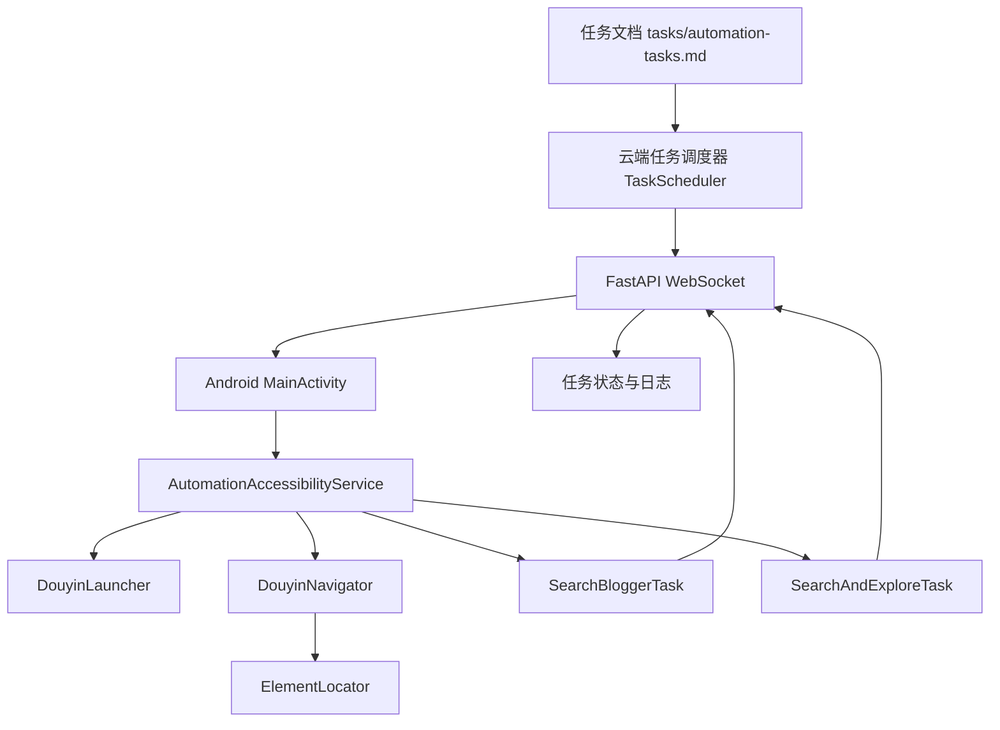
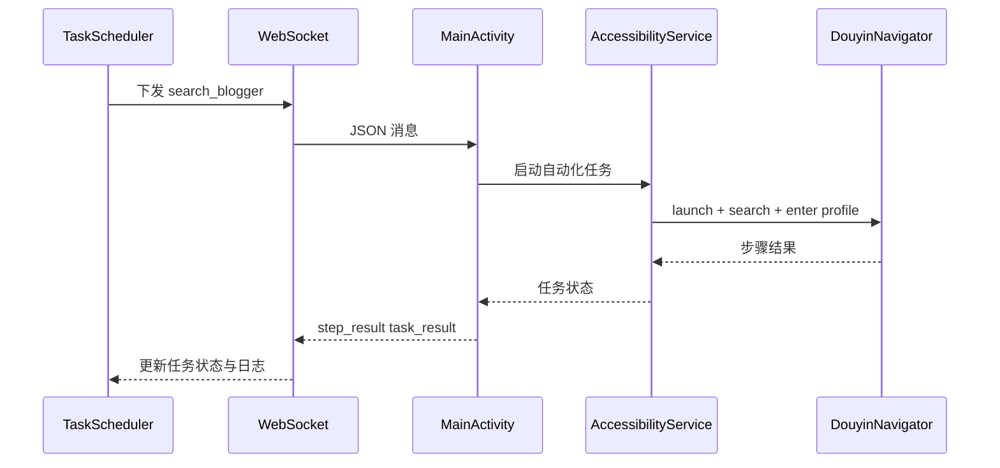
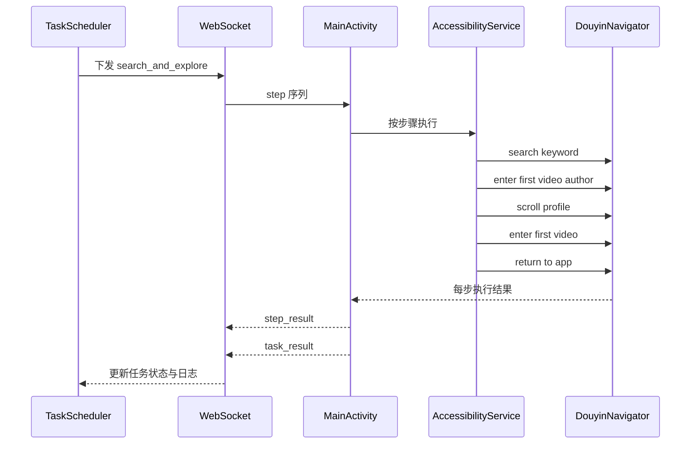

# v0.2 技术设计文档

## 1. 文档目标

本设计文档用于承接 [`v0.2 需求文档`](plans/v0.2/v0.2-requirements.md)，明确当前版本的实现边界、模块职责、消息协议、任务模型与验证方式。

`v0.2` 的目标是在 [`v0.1`](plans/v0.1/README.md) 已有通信能力基础上，形成两条可稳定执行的正式闭环：

- `search_blogger`
- `search_and_explore`

这意味着 `v0.2` 不再只验证博主搜索，而是要同时覆盖：

- 云端读取任务文档
- 云端向 Android 端下发任务
- Android 端启动抖音
- Android 端执行搜索关键词或搜索博主
- Android 端进入目标博主主页
- Android 端执行主页滑动与作品进入等探索动作
- Android 端逐步上报结果
- 云端记录执行状态与日志

---

## 2. 版本范围

### 2.1 本版本必须交付

1. `search_blogger` 任务闭环
2. `search_and_explore` 任务闭环
3. 抖音启动能力
4. 搜索输入与触发能力
5. 搜索结果等待能力
6. 进入博主主页能力
7. 从搜索结果进入第一个作品作者主页能力
8. 博主主页滑动探索能力
9. 进入博主首个作品能力
10. 返回 App 主界面能力
11. 步骤级结果上报
12. 任务级结果上报
13. 云端任务状态维护

### 2.2 本版本暂不交付

以下能力保留在后续版本，文档中可以保留占位，但不纳入本次实现验收：

- `collect_comments`
- `send_message`
- 基于视觉模型的页面理解
- 通用任务 DSL 引擎
- 多设备并发调度
- 评论区识别与采集
- 私信发送流程
- 更复杂的异常自恢复编排

### 2.3 对 [`tasks/automation-tasks.md`](tasks/automation-tasks.md) 的约束

当前任务文档中允许同时存在两类正式任务：

- `search_blogger`
- `search_and_explore`

在 `v0.2` 阶段，这两类任务都属于正式验收路径，云端调度器必须能够识别、排序、派发并跟踪它们的执行状态。

---

## 3. 系统设计

### 3.1 架构关系



### 3.2 执行链路

#### `search_blogger`



#### `search_and_explore`



---

## 4. 模块职责设计

### 4.1 [`cloud-server/src/task_scheduler.py`](cloud-server/src/task_scheduler.py)

职责：

- 从 [`tasks/automation-tasks.md`](tasks/automation-tasks.md) 加载待执行任务
- 将文档任务解析为内存任务对象
- 按优先级选择任务
- 向 Android 端发送统一格式的任务消息
- 接收步骤结果与最终结果后更新状态
- 将结果写入日志文件

设计要求：

- 解析逻辑必须同时支持 `search_blogger` 与 `search_and_explore`
- `search_blogger` 可按单任务消息直接派发
- `search_and_explore` 可按 `task_start + step` 序列派发
- 任务状态必须覆盖 `pending` `running` `completed` `failed`
- 日志中必须记录任务 ID、步骤、结果、失败原因

### 4.2 [`cloud-server/src/main.py`](cloud-server/src/main.py)

职责：

- 对外提供基础 HTTP 状态接口
- 提供 WebSocket 连接入口
- 在设备连接后允许云端下发任务
- 提供任务统计与任务详情查询

设计要求：

- WebSocket 消息分为任务下发、步骤反馈、任务反馈三类
- 连接断开后设备状态需要清理
- 测试页面和控制台页面只作为调试辅助，不作为主流程依赖
- `search_and_explore` 的步骤派发顺序必须和任务文档保持一致

### 4.3 [`android-app/app/src/main/java/com/douyin/automation/MainActivity.kt`](android-app/app/src/main/java/com/douyin/automation/MainActivity.kt)

职责：

- 与云端建立 WebSocket 连接
- 接收任务消息并触发执行
- 负责基础日志展示
- 将 WebSocket 客户端引用传递给无障碍服务

设计要求：

- 消息路由需区分 `task_start` `step` `search_blogger`
- `MainActivity` 负责消息分发与回传，不直接承载复杂自动化逻辑
- `search_and_explore` 的各步骤动作应通过统一步骤执行入口分发到服务层

### 4.4 [`android-app/app/src/main/java/com/douyin/automation/accessibility/AutomationAccessibilityService.kt`](android-app/app/src/main/java/com/douyin/automation/accessibility/AutomationAccessibilityService.kt)

职责：

- 持有无障碍服务生命周期
- 初始化定位器、导航器、任务执行器
- 作为自动化能力入口
- 监听窗口变化并同步页面状态

设计要求：

- 服务必须支持外部查询运行状态
- 必须暴露统一任务执行入口
- 窗口变化事件要通知导航器更新页面上下文
- 同时支持整体任务执行与单步骤动作执行

### 4.5 [`android-app/app/src/main/java/com/douyin/automation/task/SearchBloggerTask.kt`](android-app/app/src/main/java/com/douyin/automation/task/SearchBloggerTask.kt)

职责：

- 编排 `search_blogger` 任务完整步骤
- 聚合启动抖音、搜索博主、进入主页、上报结果等行为
- 对失败环节进行统一收口

标准步骤建议：

1. 检查任务是否已取消
2. 启动抖音
3. 等待首页稳定
4. 打开搜索页
5. 输入博主名称
6. 触发搜索
7. 等待搜索结果
8. 进入博主主页
9. 校验主页状态
10. 上报任务成功或失败

### 4.6 [`android-app/app/src/main/java/com/douyin/automation/task/SearchAndExploreTask.kt`](android-app/app/src/main/java/com/douyin/automation/task/SearchAndExploreTask.kt)

职责：

- 编排 `search_and_explore` 的完整探索流程
- 管理从搜索到进入作者主页、主页滑动、进入作品、返回首页的动作序列
- 统一步骤执行结果和失败回退逻辑

标准步骤建议：

1. 启动抖音
2. 搜索关键词
3. 进入第一个作品作者主页
4. 滑动作者主页
5. 进入作者第一个作品
6. 返回 App 主界面
7. 上报任务结果

### 4.7 [`android-app/app/src/main/java/com/douyin/automation/douyin/DouyinNavigator.kt`](android-app/app/src/main/java/com/douyin/automation/douyin/DouyinNavigator.kt)

职责：

- 负责抖音界面的导航操作
- 负责搜索框、搜索结果、博主主页、作品页等 UI 操作
- 对页面状态进行最小识别

设计要求：

- 搜索相关动作尽量原子化
- 探索类动作需拆分为独立方法
- 页面判断以无障碍节点特征为主
- 对页面变化等待和重试做基础封装
- 所有方法返回明确的布尔结果或结构化结果

建议最少提供以下动作接口：

- `searchBlogger`
- `searchKeyword`
- `enterProfile`
- `enterFirstVideoAuthor`
- `scrollProfile`
- `enterFirstVideo`
- `returnToHome`

### 4.8 [`android-app/app/src/main/java/com/douyin/automation/locator/ElementLocator.kt`](android-app/app/src/main/java/com/douyin/automation/locator/ElementLocator.kt)

职责：

- 基于资源 ID、文本、类名等查找节点
- 提供等待节点出现的基础能力
- 为导航器提供稳定的元素定位支持

设计要求：

- 先支持文本匹配与资源 ID 匹配
- 封装重试与超时机制
- 避免把复杂业务逻辑放入定位器
- 为搜索结果列表、作品列表、主页作品网格等节点定位提供复用能力

---

## 5. 任务模型设计

### 5.1 正式验收任务

`v0.2` 正式验收包含两个任务类型。

#### `search_blogger`

```yaml
task_id: task_search_blogger_001
task_name: 搜索博主并进入主页
type: search_blogger
status: pending
priority: 1
config:
  blogger_name: 罗翔说刑法
  retry_count: 3
  timeout: 60
created_at: 2026-05-16 00:00:00
```

#### `search_and_explore`

```yaml
task_id: task_search_explore_001
task_name: 搜索关键词后探索作者主页
type: search_and_explore
status: pending
priority: 2
config:
  search_keyword: 妮子
  steps:
    - action: search_keyword
      keyword: 妮子
    - action: enter_first_video_author
    - action: scroll_profile
      scroll_count: 3
    - action: enter_first_video
    - action: return_to_app
  retry_count: 3
  timeout: 180
created_at: 2026-05-16 00:00:00
```

### 5.2 任务字段约束

| 字段 | 说明 |
|------|------|
| `task_id` | 唯一任务标识 |
| `task_name` | 任务名称，用于日志和界面展示 |
| `type` | 当前版本正式支持 `search_blogger` 与 `search_and_explore` |
| `status` | 初始状态应为 `pending` |
| `priority` | 越小优先级越高 |
| `config.retry_count` | 失败重试次数 |
| `config.timeout` | 单任务超时时间 |

### 5.3 `search_and_explore` 步骤字段约束

| 字段 | 说明 |
|------|------|
| `action` | 步骤动作类型 |
| `keyword` | 搜索动作关键字，仅 `search_keyword` 使用 |
| `scroll_count` | 滑动次数，仅 `scroll_profile` 使用 |
| `description` | 步骤描述，用于日志和调试 |

---

## 6. 消息协议设计

### 6.1 云端下发消息

#### `search_blogger`

```json
{
  "type": "search_blogger",
  "task_id": "task_search_blogger_001",
  "blogger_name": "罗翔说刑法",
  "retry_count": 3,
  "timeout": 60
}
```

#### `search_and_explore` 任务开始消息

```json
{
  "type": "task_start",
  "task_id": "task_search_explore_001",
  "task_name": "搜索关键词后探索作者主页",
  "total_steps": 5
}
```

#### `search_and_explore` 步骤消息

```json
{
  "type": "step",
  "task_id": "task_search_explore_001",
  "step_index": 1,
  "action": "search_keyword",
  "keyword": "妮子",
  "description": "搜索关键词 妮子"
}
```

### 6.2 Android 端上报消息

#### 步骤结果消息

```json
{
  "type": "step_result",
  "task_id": "task_search_explore_001",
  "step_index": 2,
  "success": true,
  "message": "已进入第一个作品作者主页"
}
```

#### 任务结果消息

```json
{
  "type": "task_result",
  "task_id": "task_search_explore_001",
  "success": true,
  "result": {
    "task_type": "search_and_explore",
    "search_keyword": "妮子",
    "profile_entered": true,
    "first_video_entered": true,
    "returned_home": true
  }
}
```

### 6.3 步骤标准化建议

为了让云端日志与客户端行为一致，建议按以下步骤编号固化。

#### `search_blogger`

| step_index | 含义 |
|-----------|------|
| 1 | 启动抖音 |
| 2 | 搜索博主 |
| 3 | 进入主页 |
| 4 | 校验并完成上报 |

#### `search_and_explore`

| step_index | 含义 |
|-----------|------|
| 1 | 搜索关键词 |
| 2 | 进入第一个作品作者主页 |
| 3 | 滑动博主主页 |
| 4 | 进入第一个作品 |
| 5 | 返回 App 主界面 |

---

## 7. 页面状态设计

### 7.1 最小页面状态集合

`v0.2` 需要识别以下状态：

- 抖音首页
- 搜索输入页
- 搜索结果页
- 作品播放页
- 博主主页
- 博主作品列表区
- 未知页

### 7.2 状态判断策略

优先顺序：

1. 资源 ID
2. 文本特征
3. 类名辅助判断
4. 最近窗口变化记录

### 7.3 失败回退策略

当任一步骤失败时，按以下顺序回退：

1. 当前步骤内重试
2. 当前页面重新定位元素后重试
3. 返回上一级页面后重试
4. 重新启动抖音后重试
5. 超过重试次数后上报失败

---

## 8. 日志与可观测性设计

### 8.1 Android 端日志要求

每个关键动作至少输出：

- 动作名称
- 输入参数
- 成功或失败
- 失败原因
- 所属任务 ID
- 所属步骤序号

### 8.2 云端日志要求

任务日志至少包含：

- 任务 ID
- 设备 ID
- 任务类型
- 开始时间
- 结束时间
- 每步结果
- 失败原因

### 8.3 控制台展示建议

控制台页面建议展示：

- 当前连接设备数
- 当前运行任务
- 任务队列长度
- 最近任务执行结果
- 最近失败原因
- 最近步骤执行轨迹

---

## 9. 验收标准

### 9.1 功能验收

满足以下全部条件可认为 `v0.2` 功能闭环成立：

1. 云端能读取并识别 `search_blogger` 与 `search_and_explore` 任务
2. Android 端收到任务后能启动抖音
3. 能完成搜索关键词或博主名称输入与触发
4. 能识别搜索结果并进入目标博主主页
5. 能从搜索结果进入第一个作品作者主页
6. 能在博主主页执行指定次数滑动
7. 能进入博主的第一个作品
8. 能返回 App 主界面
9. 能在每个关键步骤后上报状态
10. 云端能正确更新任务状态为成功或失败

### 9.2 异常验收

以下异常路径至少要有可观测结果：

- 抖音未安装
- 无障碍服务未开启
- 搜索框未找到
- 搜索结果超时
- 博主主页未进入成功
- 作品作者入口未找到
- 主页滑动失败
- 首个作品进入失败
- 返回首页失败
- WebSocket 连接中断

---

## 10. 后续版本衔接

`v0.2` 完成后，为 [`v0.3`](plans/development-roadmap.md) 提供的直接基础包括：

- 稳定的页面状态识别框架
- 已验证的任务下发与结果回传协议
- 可扩展的任务调度与状态跟踪模型
- 博主主页定位能力
- 从搜索结果到作品页的导航链路

后续版本可在本设计基础上扩展：

- 评论区进入能力
- 评论采集与存储
- 主页作品批量遍历
- 更细粒度的异常恢复

---

## 11. 本轮文档更新建议

本轮仅更新文档，不改代码，后续建议按以下顺序进入实施：

1. 先让 [`tasks/automation-tasks.md`](tasks/automation-tasks.md) 中的 `search_blogger` 与 `search_and_explore` 都成为正式任务
2. 让 [`plans/v0.2/v0.2-tasks.md`](plans/v0.2/v0.2-tasks.md) 补齐探索动作实现清单
3. 明确 [`MainActivity`](android-app/app/src/main/java/com/douyin/automation/MainActivity.kt:173) 与 [`AutomationAccessibilityService`](android-app/app/src/main/java/com/douyin/automation/accessibility/AutomationAccessibilityService.kt:128) 的职责边界
4. 再切换到实现模式推进代码落地
