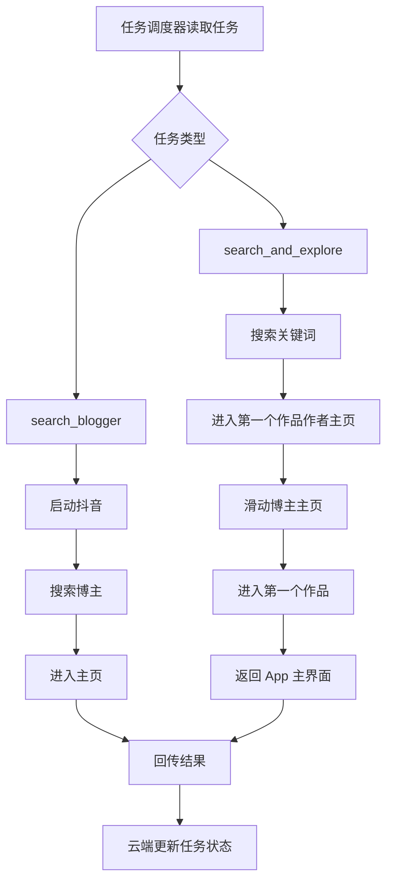

# 抖音自动化任务配置

## 📋 文档定位

本文档用于定义当前可由云端调度并由 Android 端执行的抖音自动化任务。

在 [`v0.2`](plans/v0.2/v0.2-requirements.md) 阶段，以下能力都纳入正式验收范围：

- 启动抖音
- 搜索博主
- 搜索关键词
- 进入博主主页
- 进入第一个作品作者主页
- 滑动博主主页
- 进入第一个作品
- 返回 App 主界面
- 上报步骤结果
- 上报任务结果

---

## 🎯 当前支持的任务类型

### 1. 搜索博主任务 `search_blogger`

用途：
- 搜索指定博主
- 进入博主主页
- 校验是否进入成功
- 向云端返回结果

### 2. 搜索并探索任务 `search_and_explore`

用途：
- 搜索指定关键词
- 进入搜索结果中的第一个作品作者主页
- 在作者主页滑动探索
- 进入作者第一个作品
- 返回 App 主界面
- 向云端返回结果

### 3. 采集评论任务 `collect_comments`

说明：
- 计划在后续版本实现
- 当前仅保留任务类型占位

### 4. 发送私信任务 `send_message`

说明：
- 计划在后续版本实现
- 当前仅保留任务类型占位

---

## ✅ v0.2 正式验收任务

### 任务 #1：搜索博主 - 罗翔说刑法

```yaml
task_id: task_search_blogger_001
task_name: "搜索博主并进入主页"
type: search_blogger
status: pending
priority: 1
config:
  blogger_name: "罗翔说刑法"
  retry_count: 3
  timeout: 60
created_at: "2026-05-16 22:00:00"
```

**任务说明：**
- 启动抖音
- 进入搜索页面
- 搜索博主 `罗翔说刑法`
- 进入博主主页
- 校验主页进入结果
- 上报执行结果

**标准执行步骤：**
1. 启动抖音
2. 搜索博主
3. 进入主页
4. 校验并上报结果

---

### 任务 #2：搜索关键词后探索作者主页

```yaml
task_id: task_search_explore_001
task_name: "搜索关键词后探索作者主页"
type: search_and_explore
status: pending
priority: 2
config:
  search_keyword: "妮子"
  steps:
    - action: search_keyword
      keyword: "妮子"
      description: "搜索关键词 妮子"

    - action: enter_first_video_author
      description: "进入搜索结果中第一个作品作者主页"

    - action: scroll_profile
      scroll_count: 3
      description: "在博主主页滑动3次"

    - action: enter_first_video
      description: "进入博主主页中的第一个作品"

    - action: return_to_app
      description: "返回 App 主界面"

  retry_count: 3
  timeout: 180
created_at: "2026-05-16 22:00:00"
```

**任务说明：**
- 启动抖音
- 搜索关键词 `妮子`
- 进入搜索结果中第一个作品作者主页
- 在作者主页向下滑动 3 次
- 进入作者主页中的第一个作品
- 返回 App 主界面
- 上报执行结果

**标准执行步骤：**
1. 搜索关键词
2. 进入第一个作品作者主页
3. 滑动博主主页
4. 进入第一个作品
5. 返回 App 主界面

---

## 🔧 任务配置参数说明

### 通用参数

| 参数 | 类型 | 必填 | 说明 |
|------|------|------|------|
| `task_id` | string | 是 | 任务唯一标识 |
| `task_name` | string | 否 | 任务名称 |
| `type` | string | 是 | 任务类型 |
| `status` | string | 是 | 初始状态 |
| `priority` | int | 是 | 优先级，值越小越高 |
| `created_at` | string | 是 | 创建时间 |

### `search_blogger` 参数

| 参数 | 类型 | 必填 | 说明 |
|------|------|------|------|
| `config.blogger_name` | string | 是 | 博主名称 |
| `config.retry_count` | int | 否 | 失败重试次数，默认 3 |
| `config.timeout` | int | 否 | 超时时间，默认 60 秒 |

### `search_and_explore` 参数

| 参数 | 类型 | 必填 | 说明 |
|------|------|------|------|
| `config.search_keyword` | string | 是 | 搜索关键词 |
| `config.steps` | array | 是 | 执行步骤列表 |
| `config.retry_count` | int | 否 | 失败重试次数 |
| `config.timeout` | int | 否 | 超时时间 |

### `search_and_explore` 步骤动作说明

| 动作 | 说明 | 参数 |
|------|------|------|
| `search_keyword` | 搜索关键词 | `keyword` |
| `enter_first_video_author` | 进入第一个作品作者主页 | 无 |
| `scroll_profile` | 滑动博主主页 | `scroll_count` |
| `enter_first_video` | 进入第一个作品 | 无 |
| `return_to_app` | 返回 App 主界面 | 无 |

---

## 📡 云端下发协议

### 下发 `search_blogger`

```json
{
  "type": "search_blogger",
  "task_id": "task_search_blogger_001",
  "blogger_name": "罗翔说刑法",
  "retry_count": 3,
  "timeout": 60
}
```

### 下发 `search_and_explore` 任务开始消息

```json
{
  "type": "task_start",
  "task_id": "task_search_explore_001",
  "task_name": "搜索关键词后探索作者主页",
  "total_steps": 5
}
```

### 下发 `search_and_explore` 步骤消息

```json
{
  "type": "step",
  "task_id": "task_search_explore_001",
  "step_index": 1,
  "action": "search_keyword",
  "keyword": "妮子",
  "description": "搜索关键词 妮子"
}
```

---

## 📥 Android 端回传协议

### 步骤结果回传

```json
{
  "type": "step_result",
  "task_id": "task_search_explore_001",
  "step_index": 2,
  "success": true,
  "message": "已进入第一个作品作者主页"
}
```

### 任务结果回传

```json
{
  "type": "task_result",
  "task_id": "task_search_explore_001",
  "success": true,
  "result": {
    "task_type": "search_and_explore",
    "search_keyword": "妮子",
    "profile_entered": true,
    "first_video_entered": true,
    "returned_home": true
  }
}
```

---

## 📊 任务状态说明

| 状态 | 说明 |
|------|------|
| `pending` | 等待执行 |
| `running` | 执行中 |
| `completed` | 执行成功 |
| `failed` | 执行失败 |
| `cancelled` | 已取消 |

---

## 🚀 使用方式

### 方式 1：编辑任务文档

1. 在 [`tasks/automation-tasks.md`](tasks/automation-tasks.md) 中维护任务
2. 云端启动后读取任务配置
3. 调度器按优先级选择任务
4. 将任务发送给已连接设备
5. 接收步骤结果和任务结果
6. 更新任务状态和日志

### 方式 2：通过 API 创建任务

```python
task = {
    "task_id": "task_search_explore_002",
    "task_name": "搜索关键词后探索作者主页",
    "type": "search_and_explore",
    "status": "pending",
    "priority": 1,
    "config": {
        "search_keyword": "测试关键词",
        "steps": [
            {"action": "search_keyword", "keyword": "测试关键词"},
            {"action": "enter_first_video_author"},
            {"action": "scroll_profile", "scroll_count": 3},
            {"action": "enter_first_video"},
            {"action": "return_to_app"}
        ],
        "retry_count": 3,
        "timeout": 180
    },
    "created_at": "2026-05-16 22:00:00"
}
```

---

## 📈 v0.2 正式执行流程



---

## 🧪 验收要求

### `search_blogger` 验收通过标准

需同时满足：

1. 任务可以被云端识别并成功下发
2. App 可以收到任务并开始执行
3. 抖音可以被正常启动
4. 可以输入博主名称并触发搜索
5. 可以进入目标博主主页
6. 每个关键步骤均有回传日志
7. 云端最终能更新任务状态

### `search_and_explore` 验收通过标准

需同时满足：

1. 任务可以被云端识别并成功下发
2. App 可以收到 `task_start` 与 `step` 序列消息
3. 可以完成关键词搜索
4. 可以进入搜索结果中第一个作品作者主页
5. 可以执行指定次数主页滑动
6. 可以进入作者主页中的第一个作品
7. 可以返回 App 主界面
8. 每一步均可上报结果
9. 云端最终能更新任务状态

### 典型失败场景

- 无障碍服务未启动
- 抖音未安装
- 搜索框未找到
- 搜索结果页未加载完成
- 目标博主主页未进入成功
- 作品作者入口未找到
- 滑动主页失败
- 第一个作品进入失败
- 返回 App 主界面失败
- WebSocket 连接断开

---

## 🎯 当前待执行任务队列

当前建议队列顺序：

1. ⏳ `task_search_blogger_001` - 搜索博主并进入主页
2. ⏳ `task_search_explore_001` - 搜索关键词后探索作者主页

说明：
- 两项均为 [`v0.2`](plans/v0.2/v0.2-requirements.md) 正式验收任务
- 第一项优先验证基础搜索与主页定位
- 第二项用于验证扩展探索链路

---

## 📝 维护说明

- `search_blogger` 与 `search_and_explore` 均属于当前正式任务
- 新增复杂动作前，应先同步更新 [`plans/v0.2/technical-design.md`](plans/v0.2/technical-design.md)
- 任务文档字段变更后，需同步检查云端调度器解析逻辑

**最后更新：** 2026-05-16  
**文档版本：** 4.0  
**维护者：** 开发团队
